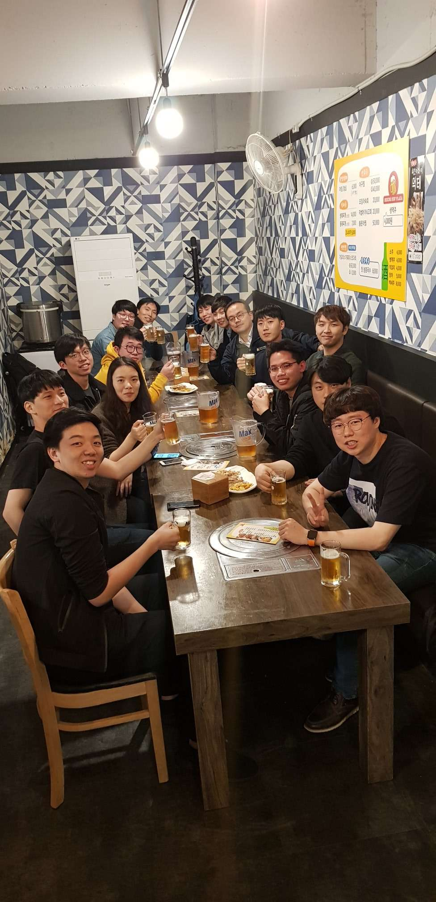

# Joshua Santoso

Hi! I am Joshua Santoso you can call me Joshua.

## Publications  
<table border:"0" border-collapse: collapse>
    <tr>
        <th border: none>No.</th>
        <th border: none>Name</th>
        <th border: none>Age</th>
    </tr>
    <tr>
        <td border: none>1</td>
        <td border: none>Peter Parker</td>
        <td border: none>16</td>
    </tr>
    <tr>
        <td border: none>2</td>
        <td border: none>Clark Kent</td>
        <td border: none>34</td>
    </tr>
</table>
  

### DEEP CORRELATION BASED HOMOGRAPHY ESTIMATION FOR IMAGE STITCHING
### Joshua Santoso, Williem, and Rini Wongso, In ICIC Express Letters, Volume 15, Number 9, September 2021. 

### Human Motion Deblurring using Localized Body Prior
### Jonathan Samuel Lumentut, Joshua Santoso, and In Kyu Park, In ACCV 2020

### Convolutional Neural Network 을 이용한 휴먼 모션 블러 데이터셋의 생성
### Joshua Santoso, Jonathan Samuel Lumentut, and In Kyu Park, In IPIU 2020

### Paper review of 3D Human Body Reconstruction
### Joshua Santoso and In Kyu Park, In Submission 

### Joint Framework of Human Motion Deblurring and Holistic 3D Body Reconstruction
### Joshua Santoso, Williem, and In Kyu Park, In Submission 

